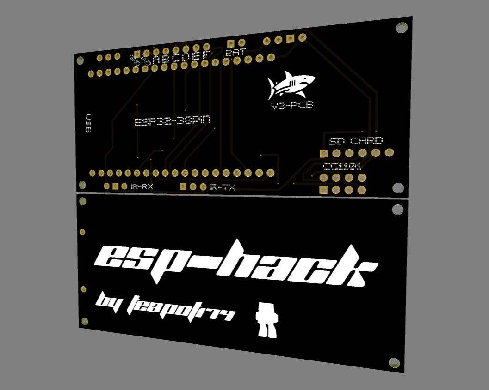
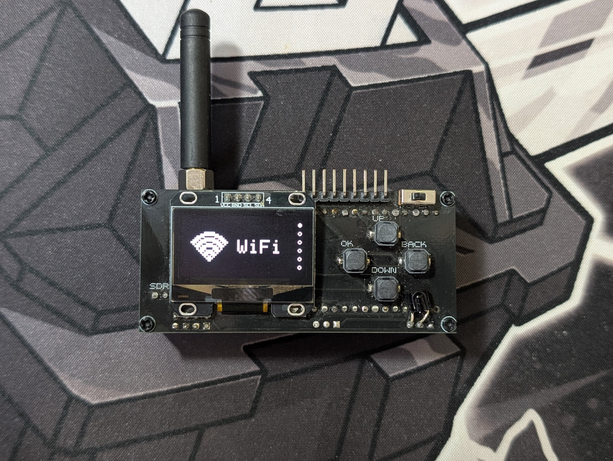

# 📡 ESP-HACK FW — [Русский](./README-ru.md)

## 🚀 About ESP-HACK FW

ESP-HACK is a powerful universal firmware for the ESP32, built for RF research and pentesting of radio frequencies, Bluetooth, infrared signals and GPIO integrations.  
The project targets enthusiasts and pentesters who want to explore protocols and devices in Sub-GHz ranges and other wireless technologies.

> *The firmware is stable within its declared functionality, but some features are marked as "in development". Use the device according to the laws in your region.*

---

### ⚠️ Disclaimer

This firmware is designed exclusively for research purposes and hardware testing.
By using the firmware, you must comply with the laws of your region. The firmware creator is not responsible for your actions. Jammers are ILLEGAL.

---

## ⚡ Features

### WiFi

- Deauther *(works, but poorly)*  
- Beacon Spam  
- EvilPortal  
- Wardriving

### Bluetooth

- BLE-Spam:
IOS, Android, Windows
- BadBLE

### SubGHz

- SubRead  
- SubSend
- Analyzer
- Bruteforce:
Came, Nice, Ansonic, Holtek, Chamberlain
- Jammer (ILLIGAL)

### Infrared

- IR-Send  
- IR-Read  
- TV, PJ, AC OFF

### GPIO

**iButton *(in development)***
- Read
- Write
- Config

**NRF24**
- Jammer (ILLIGAL)
- Spectrum
- Config

**Serial *(in development)***

### Settings
- Display Color
- Standby time
- About

---

### 📡 Supported SubGHz modulations
(315MHz/433.92MHz/868Mhz/915Mhz)
- Princeton  
- RcSwitch  
- Came
- Nice 
- Holtec
- Ansonic
- Chamberlain
- StarLine  
- KeeLoq

---

## 🛠️ Building

### 🔧 PCB

Thanks Dripside!

### 🔧 Required components

| Component | Link |
|-----------|--------|
| ESP32-WROOM | [TAP](https://aliexpress.com/item/1005007817121199.html) |
| CC1101 | [TAP](https://aliexpress.com/item/1005008544032996.html) |
| Display SH1106 | [TAP](https://aliexpress.com/item/1005004464878029.html) |
| SD Мodule | [TAP](https://aliexpress.com/item/32674518514.html) |
| Buttons | [TAP](https://aliexpress.com/item/4000452176168.html) |
| IR-TX, IR-RX | [TAP](https://aliexpress.com/item/1005007446501425.html) |

---

### 🔌 Connection scheme

| Module | Pin  | Pin  | Pin  | Pin  | Pin  | Pin  | Pin  |
|--------|-------|-------|-------|-------|-------|-------|-------|
| **📺 Display** | VCC → 3V3 | GND → GND | SCL → G22 | SDA → G21 | - | - | - |
| **🔘 Buttons** | UP → G27 | DOWN → G26 | OK → G33 | BACK → G32 | - | - | - |
| **📡 CC1101** | 1 → GND | 2 → 3V3 | 3 → G4 | 4 → G5 | 5 → G18 | 6 → G23 | 7 → G19 |
| **💡 IR** | IR-T → G12 | IR-R → G14 | - | - | - | - | - |
| **🔌 GPIO** | A → G35 | B → G25 | C → G17 | D → G16 | E → G13 | F → G12 | - |
| **💾 SD Card** | 3v3 → 3v3 | GND → GND | MOSI → G15 | CLK → G2 | MISO → G0 | CS → GND | - |

---

## Errors (ERROR:)

During operation ESP-HACK may show the following errors:

| Error code | ❌ Problem | 🛠️ Possible fix |
|------------|-----------|------------------|
| **0x000**  | SD-Card initialization failed | 🛠️ Format the SD card as **FAT32** or replace it. |
| **0x001**  | CC1101 initialization failed | 🛠️ Check wiring and module functionality (power, SPI, contacts). |
| **0x002**  | NRF24 initialization failed | 🛠️ Verify chosen pins/connections and reboot the device. |

---

## 📸 Final result

---

## ✉️ Contacts / Author

Author: Teapot174  
Telegram: `@ESPH4CK`
